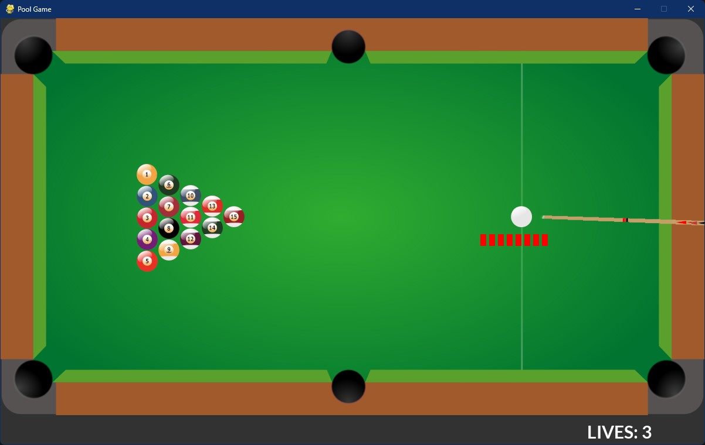

# POOL GAME
The Pool Game project is a Python-based endeavor utilizing libraries such as pygame and pymunk. This project aims to implement the MCTS AI algorithm while tackling realistic physics.

## IMAGE DEMO

</img>

